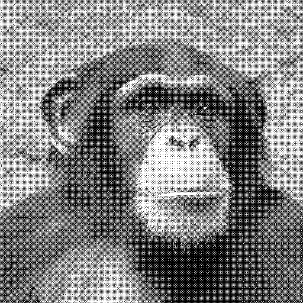

# Dither

Dither is a visual exploration of the Dither algorithm. When I wrote this project, I wanted to understand how this algorithm worked and the kind of images one could expect to get from it.



## Usage

To run this project, you have a couple ways, the first and easiest way is to install the Processing IDE, open it and run it.

If you want a cleaner way, I'd recommend installing **processing-java**. If you do that you can then just do:

```
make
```

## Installation

**I do not recommend to install this project**, but you still have the option.

```
make build
sudo make install
make clean
```

## Licence

This project is licenced under the gplv2 licence.
For more information, read the license file.
